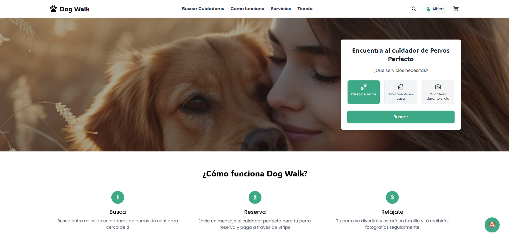
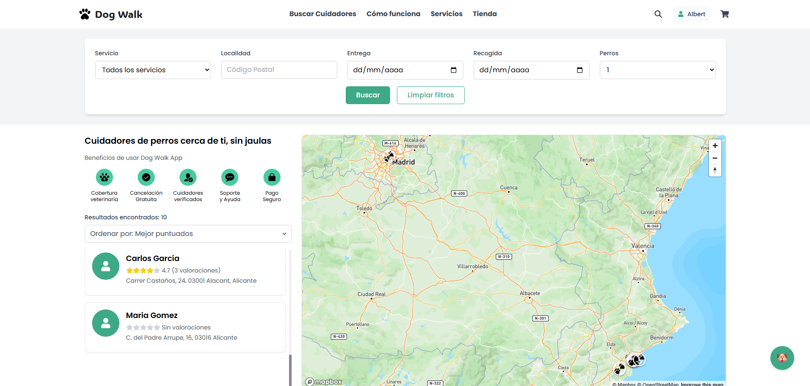
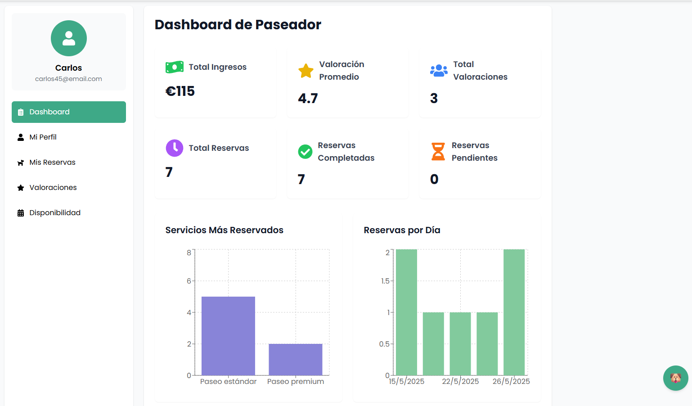
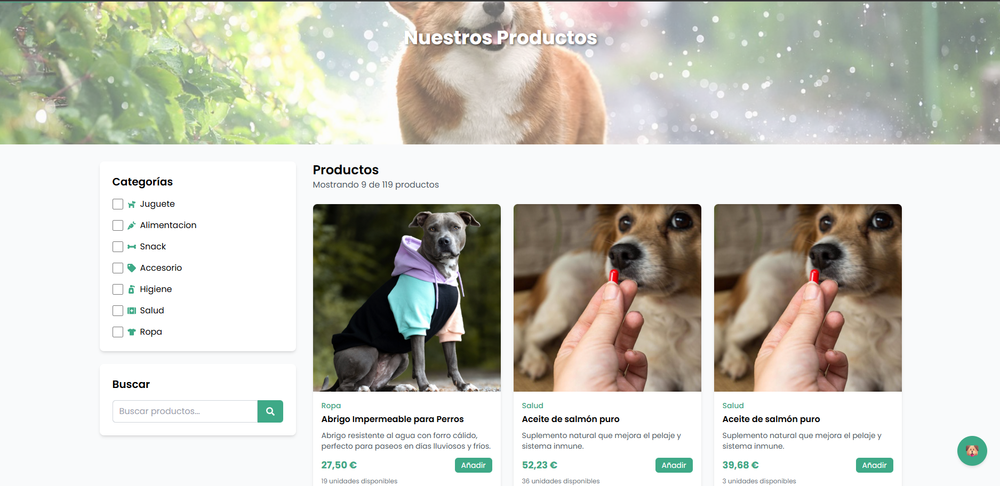
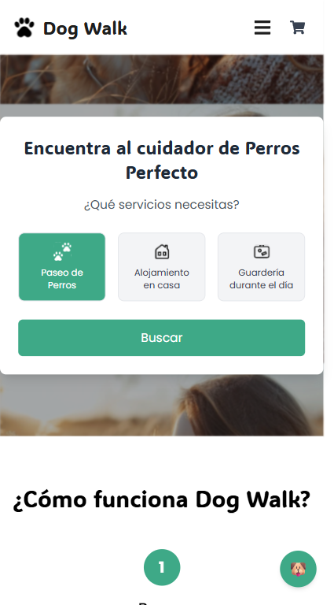
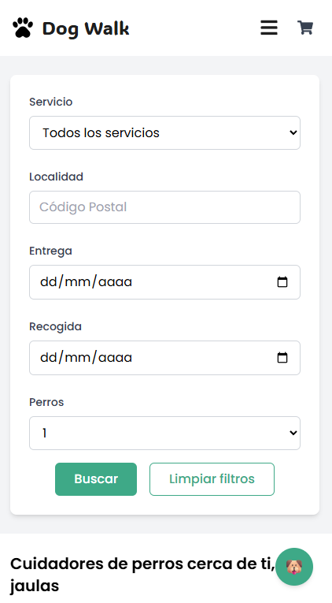

# 🐾 DogWalk - Frontend

## 📝 Descripción

DogWalk es una plataforma moderna que conecta a dueños de perros con cuidadores profesionales. Ofrece servicios de paseo, alojamiento y guardería, junto con una tienda integrada de productos para mascotas.

## ✨ Características Principales

- 🔍 Búsqueda avanzada de cuidadores con filtros
- 🗺️ Integración con mapas para localizar cuidadores
- 💬 Sistema de mensajería en tiempo real
- ⭐ Sistema de valoraciones y reseñas
- 🛒 Tienda integrada de productos para mascotas
- 📅 Gestión de reservas y disponibilidad
- 🔐 Sistema de autenticación y autorización
- 🤖 Asistente virtual inteligente para ayuda y soporte

## 🚀 Tecnologías

- React 19
- TailwindCSS
- Framer Motion
- Mapbox GL
- Zustand
- React Router
- GSAP

## 📦 Instalación

1. Clona el repositorio:
git clone https://github.com/aam9063/DogWalk-Frontend.git

2. Instala las dependencias:

cd DogWalk-Frontend
npm install

3. Crea un archivo .env en la raíz del proyecto y configura las variables de entorno necesarias:
.env
VITE_API_URL=tu_url_api
VITE_MAPBOX_TOKEN=tu_token_mapbox

4. Inicia el servidor de desarrollo:
npm run dev

## 🔧 Scripts Disponibles

- \`npm run dev\`: Inicia el servidor de desarrollo
- \`npm run build\`: Construye la aplicación para producción
- \`npm run preview\`: Previsualiza la versión de producción
- \`npm run lint\`: Ejecuta el linter
- \`npm run test\`: Ejecuta los tests

## 📱 Capturas de Pantalla

| Página de inicio | Búsqueda de cuidadores |
|-----------------|------------------------|
|  |  |

| Perfil de cuidador | Tienda |
|-------------------|--------|
|  |  |

### 📱 Vista móvil

| Home móvil | Búsqueda móvil |
|------------|----------------|
|  |  |

## 🌐 Demo en Vivo

[Enlace a tu demo en vivo]

## 📄 Documentación

Para más información sobre la arquitectura y funcionamiento del proyecto, consulta nuestra [documentación técnica](link-a-tu-documentacion).

## 🤝 Contribuir

Las contribuciones son bienvenidas. 

## 📝 Licencia

Este proyecto está bajo la Licencia MIT - mira el archivo [LICENSE.md](LICENSE.md) para más detalles.

## 👥 Autores

- Tu Nombre - [Albert](https://github.com/aam9063)

## 📞 Contacto

- Email: albert9063@gmail.com
- LinkedIn: [Albert Alarcón Martínez](www.linkedin.com/in/albert-alarcón-martínez-04044a51)
- Portfolio: [AlbertDev](https://codewithalbert.netlify.app/)

---
⌨️ con ❤️ por [Albert](https://github.com/aam9063)
